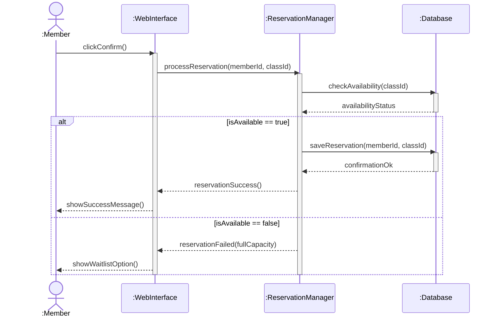
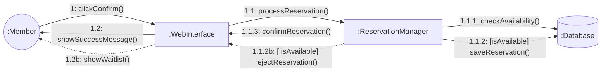

# Entornos-7.5

### Tarea 1: Diagrama de Casos de Uso
En este diagrama definimos los límites del sistema (`GymMasterSystem`) y la interacción de nuestros dos actores principales: el Socio (`Member`) y el Administrador (`Admin`). 
* **Include**: El caso de uso de reservar clase (`BookClass`) requiere obligatoriamente que el usuario inicie sesión (`Login`).
* **Extend**: Apuntarse a la lista de espera (`JoinWaitlist`) es un comportamiento opcional que extiende de la reserva si la clase está llena.

### Tarea 2: Diagrama de Secuencia
Nos centramos en el momento exacto en que un Socio pulsa el botón "Confirmar Reserva".
* **Objetos**: Intervienen las entidades (`:Member`), (`:WebInterface`), (`:ReservationManager`) y (`:Database`).
* **Flujo condicional**: Se utiliza un fragmento combinado `alt` para gestionar si la base de datos devuelve que hay disponibilidad o si, por el contrario, la clase está llena.

### Tarea 3: Diagrama de Comunicación
Muestra la misma interacción pero enfocada en los enlaces entre objetos.
* **Numeración decimal**: Utiliza correctamente la numeración decimal (`1`, `1.1`, `1.1.1`...) para el orden de los mensajes.
* **Condicionales**: Se usan corchetes (`[isAvailable]`) para indicar las guardas lógicas de las alternativas.

### Tarea 4: Diagrama de Actividades
Antes de confirmar la reserva, el gimnasio sigue un protocolo interno de seguridad y pagos.
* **Pasos**: 1. Recibir solicitud -> 2. ¿Socio tiene cuota pagada? (Decisión) -> 3. ¿Hay aforo? (Decisión) -> 4. Bloquear plaza -> 5. Enviar email de confirmación.
* **Símbolos**: Usa correctamente los símbolos de inicio, fin, acciones y rombos de decisión.

```mermaid
flowchart TD
    Start(( )):::startNode
    End(( )):::endNode
    End2(( )):::endNode
    End3(( )):::endNode

    Step1[1. Receive Request]
    Step4[4. Block Spot]
    Step5[5. Send Confirmation Email]
    Reject[Reject: Unpaid Quota]
    Waitlist[Offer Waitlist]

    Dec2{2. Is Quota Paid?}
    Dec3{3. Has Capacity?}

    Start --> Step1
    Step1 --> Dec2
    
    Dec2 -- "[yes]" --> Dec3
    Dec2 -- "[no]" --> Reject --> End2
    
    Dec3 -- "[yes]" --> Step4
    Dec3 -- "[no]" --> Waitlist --> End3
    
    Step4 --> Step5
    Step5 --> End

    classDef startNode fill:#000,stroke:#000,stroke-width:2px;
    classDef endNode fill:#fff,stroke:#000,stroke-width:4px;
```

