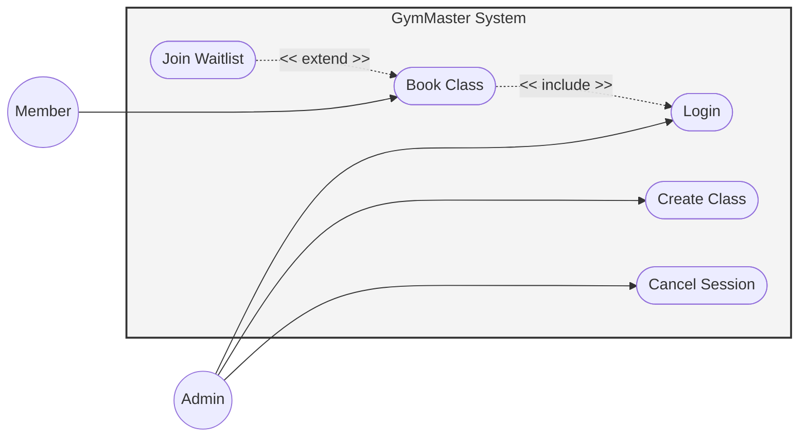

# Entornos-7.5

## Fase 1: Análisis de Requisitos

### Tarea 1: Diagrama de Casos de Uso
En este diagrama definimos los límites del sistema (`GymMasterSystem`) y la interacción de nuestros dos actores principales: el Socio (`Member`) y el Administrador (`Admin`). 
* **Include**: El caso de uso de reservar clase (`BookClass`) requiere obligatoriamente que el usuario inicie sesión (`Login`).
* **Extend**: Apuntarse a la lista de espera (`JoinWaitlist`) es un comportamiento opcional que extiende de la reserva si la clase está llena.

